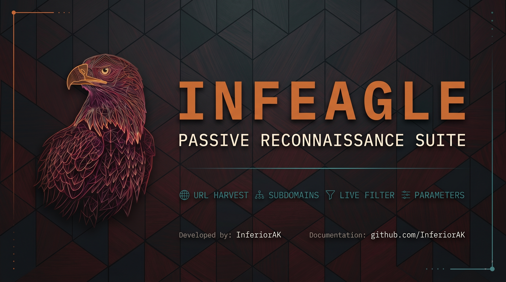

<div align="center">

# Infeagle-Recon




**Passive Reconnaissance Suite** — Harvest URLs, discover subdomains, filter live endpoints, and extract parameters — all from public archives and OSINT sources.

[](LICENSE)
[](https://www.gnu.org/software/bash/)
[](https://python.org)
[](https://github.com/InferiorAK/Infeagle-Recon/pulls)
[](https://github.com/InferiorAK/Infeagle-Recon/graphs/commit-activity)

<p align="center">
    
    
    
    
</p>

**Author:** [InferiorAK](https://github.com/InferiorAK)

</div>

---

### Connect with Me

<div align="center">

[](https://github.com/InferiorAK)
[](https://www.facebook.com/InferiorAK)
[](https://m.me/InferiorAK)
[](https://www.twitter.com/InferiorAK)
[](https://youtube.com/@InferiorAK)

**[Visit My Portfolio](https://inferiorak.integratedhawkers.com/)**

</div>

---

## Features

| # | Phase | Description |
|---|-------|-------------|
| 1 | **URL Harvesting** | Collect URLs from CommonCrawl, Wayback Machine, and VirusTotal |
| 2 | **Subdomain Discovery** | Find subdomains via crt.sh, URLScan.io, AnubisDB, VirusTotal, and URL host extraction |
| 3 | **Live Filtering** | Async HTTP probe with aiohttp — checks reachability and status codes |
| 4 | **Parameter Extraction** | Extract URL query parameters from live endpoints |

### Why Infeagle?

- **No API keys required** for most sources (only VirusTotal is optional)
- **Fully passive** — no active scanning, no direct requests to the target
- **Modular** — run individual phases or the full pipeline
- **Configurable** — tune timeouts, concurrency, sources via `conf.json`
- **Progress bar** — real-time visibility into long-running operations
- **Silent mode** — pipe-friendly output for chaining with other tools

---

## Requirements

- **Bash** 4.0+
- **curl**, **jq**, **python3**
- **Python packages:** `aiohttp`, `colorama`, `tqdm`

```bash
sudo apt install curl jq python3
pip install aiohttp colorama tqdm
```

---

## Installation

```bash
git clone https://github.com/InferiorAK/Infeagle-Recon.git
cd Infeagle-Recon
chmod +x infeagle.sh
```

---

## Usage

```
Author: InferiorAK

Usage: infeagle.sh <command> [options]

Commands:
  full   Run all phases (URLs → subdomains → live → params)
  sub    Subdomain discovery (from URLs + dedicated sources)
  live   Live URL filter with probe
  param  Parameter extraction from live URLs

Global flags:
  -d <domain>   Target domain
  -o <dir>      Output directory (default: recon/<domain>)
  -f <file>     Input file (skip archive harvest)
  -u <url>      Single URL (skip archive harvest)
  -q,--silent   Suppress banner
  -h            Show this help

Run infeagle.sh <command> --help for command-specific options

Config:  Edit conf.json for VirusTotal API key and defaults
```

### Full Pipeline

```bash
./infeagle.sh full -d example.com
./infeagle.sh full -d example.com -o ~/results/example
./infeagle.sh full -d example.com -q                # silent mode
```

### Subdomain Discovery

```bash
./infeagle.sh sub -d example.com
./infeagle.sh sub -d example.com -f urls.txt         # extract from existing URLs
./infeagle.sh sub -d example.com -q
```

### Live URL Filtering

```bash
./infeagle.sh live -f urls.txt
./infeagle.sh live -f urls.txt -c 50 -t 5 --mc 200,301,302
./infeagle.sh live -u https://example.com/page       # single URL
./infeagle.sh live -f urls.txt -q                    # progress bar only
```

### Parameter Extraction

```bash
./infeagle.sh param -d example.com                   # from recon/example.com/live.txt
./infeagle.sh param -f results/live.txt              # from custom file
./infeagle.sh param -d example.com -q
```

---

## Screenshots

#### Suite running as Full discovery mode


*Full pipeline execution — URL harvest, subdomain discovery, live filtering and parameter extraction.*

#### Scanned Live URLs


*Some fetched live endpoints*

#### XSS found just from Recon


*XSS popup triggered from a live grabbed endpoint discovered by Infeagle.*

---

## Configuration

Edit `conf.json` to customize behavior:

```json
{
    "general": {
        "output_base": "recon",
        "keep_raw": true
    },
    "virustotal_api_key": "your-key-here",
    "archive": {
        "timeout": 180,
        "commoncrawl": {
            "enabled": true,
            "index": "latest",
            "max_pages": 0
        },
        "wayback": {
            "enabled": true
        },
        "virustotal_urls": {
            "enabled": true
        }
    },
    "subdomains": {
        "crtsh": {
            "enabled": true
        },
        "urlscan": {
            "enabled": true
        },
        "anubis": {
            "enabled": true
        },
        "virustotal": {
            "enabled": true
        }
    },
    "filter": {
        "concurrency": 20,
        "timeout": 10,
        "match_codes": "200,302",
        "follow_redirects": false
    },
    "rate_limit": {
        "pagination_wait": 1,
        "source_delay": 0
    }
}
```

| Key | Description | Default |
|-----|-------------|---------|
| `general.output_base` | Output directory base | `recon` |
| `general.keep_raw` | Keep intermediate `.raw/` files | `true` |
| `virustotal_api_key` | VirusTotal API key (optional) | `""` |
| `archive.timeout` | Max wait per API call (seconds) | `180` |
| `archive.commoncrawl.index` | CC index (`"latest"` or specific like `"CC-MAIN-2024-38"`) | `"latest"` |
| `archive.commoncrawl.max_pages` | Max CC pages per query (`0` = unlimited) | `0` |
| `filter.concurrency` | Concurrent probe connections | `20` |
| `filter.timeout` | Per-request timeout (seconds) | `10` |
| `filter.match_codes` | Status codes to consider alive | `200,302` |
| `filter.follow_redirects` | Follow redirects during probe | `false` |
| `rate_limit.pagination_wait` | Delay between CC pagination requests | `1` |

---

## Output Structure

```
recon/<domain>/
├── urls.txt                  # Harvested URLs
├── subdomains.txt            # Discovered subdomains
├── live.txt                  # Live (responding) URLs
├── params.txt                # URLs with query parameters
└── .raw/                     # Intermediate per-source results (if keep_raw=true)
    ├── commoncrawl_domain.txt
    ├── commoncrawl_wild.txt
    ├── wayback_wild.txt
    ├── wayback_domain.txt
    ├── wayback_broad.txt
    ├── virustotal_urls.txt
    ├── crtsh.txt
    ├── urlscan.txt
    ├── anubis.txt
    ├── virustotal_subs.txt
    ├── subs_from_urls.txt
    ├── subs_all.txt
    └── urls_all.txt
```

---

## How It Works

### URL Harvesting

Queries three archive sources for historical URLs:

- **CommonCrawl** — Paginated search via the CDX index API. Automatically detects the latest crawl index, or pin a specific one via config. Supports wildcard (`*.domain/*`) and exact domain (`domain/*`) queries.
- **Wayback Machine** — CDX API with `collapse=urlkey` for deduplication. Wildcard and bare-domain queries.
- **VirusTotal** — Domain report endpoint (requires API key). Extracts detected and undetected URLs.

### Subdomain Discovery

- **URL Host Extraction** — Parses hostnames from harvested URLs
- **crt.sh** — Certificate transparency log search, handles multi-value `name_value` fields
- **URLScan.io** — Public scan results
- **AnubisDB** — Passive subdomain database
- **VirusTotal** — Subdomain resolution data (requires API key)

### Live Filtering

Async HTTP probe using `aiohttp` with semaphore-based concurrency control. For each URL:
1. Try HTTPS first, fall back to HTTP
2. Match response status against allowed codes
3. Save full URLs (not just base domains) to `live.txt`
4. Progress bar shows real-time throughput

### Parameter Extraction

Simple `grep`-based extraction of query parameters (`?key=val&...`) from live URLs.

---

## Examples

```bash
# Full recon on a target
./infeagle.sh full -d example.com

# Quick subdomain enumeration only
./infeagle.sh sub -d example.com -q

# Probe a list of URLs with custom settings
./infeagle.sh live -f urls.txt -c 100 -t 3 --mc 200,301 -q

# Extract params from previously gathered live endpoints
./infeagle.sh param -f recon/example/live.txt

# Pipe live URLs into another tool (silent mode)
./infeagle.sh live -f urls.txt -q | httpx -silent
```

---

## Module Architecture

```
infeagle.sh              # Entry point — subcommand dispatcher
├── pkgs/common.sh       # Colors, logging, config loader, banner
├── pkgs/urls.sh         # CommonCrawl, Wayback, VirusTotal URL fetchers
├── pkgs/subfind.sh      # crt.sh, URLScan, Anubis, VirusTotal subdomain fetchers
├── pkgs/phases.sh       # Phase orchestration (URLs → subs → live → params)
├── pkgs/filter_live.py  # Async HTTP live probe (aiohttp)
└── conf.json            # User configuration
```

---

## License

This project is licensed under the MIT License — see the [LICENSE](LICENSE) file for details.

---

<div align="center">
  <sub>Built by <a href="https://github.com/InferiorAK">InferiorAK</a></sub>
</div>
